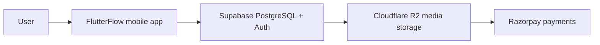

# FlutterFlow + Supabase Foundation

Status: Proposed for review  
Repository: `oxiomindia/askgeniebhai`  
Product: Ask Genie Bhai  
Phase: Development foundation only

## Foundation Decisions

FlutterFlow is the primary frontend for Ask Genie Bhai v1.0.

Supabase PostgreSQL is the primary application database.

Supabase Auth is the primary authentication system.

Cloudflare R2 is the canonical file and media storage platform.

Vercel is the canonical hosting platform for the web application and future backend services.

Razorpay is the launch-phase payments platform.

Maps are deferred until a product requirement explicitly needs them.

This document does not approve application screens, database tables, mock data, generated FlutterFlow pages, exported Flutter code, package installation, or application implementation. It only defines the required foundation for connecting the canonical stack cleanly before development begins.

## Blueprint Alignment Gate

Before any implementation task starts, confirm that the work aligns with:

- The approved Product Blueprint.
- MVP scope.
- Mobile-first strategy for Android and iOS.
- The approved five core intents once they are formally documented in this repository.
- Transaction-first philosophy.
- Repository isolation rules.

If a request conflicts with any of these, stop and report the conflict before implementation.

## Canonical Architecture

The diagram shows the approved product stack at the foundation level. It is not a data-flow contract for every future transaction. Each integration must still be approved before implementation.

## Component Responsibilities

FlutterFlow owns the mobile-first frontend experience. It should prioritize quick traveller workflows, large touch targets, minimal typing, and one primary action per screen.

Supabase PostgreSQL owns structured application data. It should store transactional records, user-linked domain data, and approved relational state.

Supabase Auth owns identity, sessions, and authenticated user context. It should provide JWT-based authentication for database access through Row Level Security.

Cloudflare R2 owns media and file storage. It should store approved user or operational files such as images, documents, and other binary assets. It is the canonical storage choice; Supabase Storage is not the primary storage solution for Ask Genie Bhai.

Vercel owns the web application surface generated for internal testing or future web needs, and future backend services that require server-side secrets, API orchestration, payment callbacks, or privileged operations.

Razorpay owns launch-phase payment collection and payment lifecycle integration.

Maps are intentionally deferred. Do not introduce maps, geocoding, routing, or location-heavy workflows until a future approved requirement needs them.

## Architecture Decisions

### FlutterFlow

FlutterFlow is selected because Ask Genie Bhai is mobile-first and needs fast iteration on native-feeling Android and iOS workflows. The frontend must remain traveller-friendly: fast, readable, low-friction, and optimized for one-handed use.

### Supabase PostgreSQL

Supabase PostgreSQL is selected for structured data because it provides a managed Postgres foundation with relational modeling, access policies, auto-generated APIs, and a clear path for transaction-first workflows.

### Supabase Auth

Supabase Auth is selected because it integrates naturally with Supabase PostgreSQL and Row Level Security. Authentication state can be used to scope database access per user without exposing privileged credentials to the mobile client.

### Cloudflare R2

Cloudflare R2 is selected as the canonical media storage layer because media and binary files should be separated from transactional database records. R2 provides object storage suitable for durable file storage and future CDN-oriented delivery patterns while keeping Supabase focused on database and authentication responsibilities.

### Vercel

Vercel is selected for the web application and future backend services. Web is not a customer-facing MVP surface, but Vercel provides a clear future path for internal web previews, operational services, server-side integrations, API endpoints, payment callbacks, and secure handling of secrets that must not live in FlutterFlow.

### Razorpay

Razorpay is selected for launch-phase payments because the product needs an India-ready payment path during launch. Payment flows must remain transaction-first and should be implemented only after the payment requirements and backend callback strategy are approved.

### Maps Deferred

Maps are deferred to keep the MVP focused. Location features can add complexity, permissions, API cost, and UX weight. They should be introduced only when an approved user intent requires them.

## Supabase Project Creation

Create one Supabase project for Ask Genie Bhai under the correct Oxiom India ownership context.

Recommended setup:

1. Open the Supabase dashboard.
2. Create a new project named `askgeniebhai` or an approved environment-specific variant such as `askgeniebhai-prod`.
3. Generate and store a strong database password in the approved password manager.
4. Do not commit the database password, service role key, connection string, or any secret to GitHub.
5. Confirm the project is healthy before connecting FlutterFlow.

Supabase should be used for PostgreSQL, Auth, RLS-backed data access, and approved database capabilities. Do not treat Supabase Storage as the default media layer.

Reference: https://supabase.com/docs/guides/platform

## Region Selection

Choose the Supabase region closest to the primary expected users.

For Ask Genie Bhai, use APAC as the default selection unless product ownership approves another region. If an exact region is required, prefer `ap-south-1` Mumbai for India-first latency, or `ap-southeast-1` Singapore if the audience is broader across Southeast Asia.

Important rule: a Supabase project region is infrastructure-bound. Changing region later requires creating a new project and migrating data/configuration, so region selection must be approved before application development starts.

References:

- https://supabase.com/docs/guides/platform/regions
- https://supabase.com/docs/guides/troubleshooting/change-project-region-eWJo5Z

## Authentication Configuration

Use Supabase Auth as the authentication system.

Initial configuration checklist:

- Enable only approved authentication providers.
- Keep email authentication enabled for the foundation.
- Require email confirmation unless product ownership explicitly approves a lower-friction alternative.
- Configure application redirect URLs only after FlutterFlow package names, bundle IDs, and deep-link strategy are approved.
- Keep anonymous sign-ins disabled unless a specific MVP intent requires them and receives approval.
- Do not enable social login providers until they are approved for MVP.

Supabase Auth issues JWTs that work with Row Level Security, so future data access must be designed around authenticated users and RLS policies.

References:

- https://supabase.com/docs/guides/auth
- https://supabase.com/docs/guides/auth/general-configuration

## Email Authentication

Email authentication is the approved baseline for foundation setup.

Production requirements:

- Configure custom SMTP before public testing or production use.
- Use a dedicated authentication sending domain, such as `auth.askgeniebhai.com`, if approved.
- Configure SPF, DKIM, and DMARC with the email provider.
- Keep authentication emails separate from marketing emails.
- Customize Supabase Auth email templates only after product copy is approved.

Do not rely on Supabase's default SMTP service for production. Supabase documents the default service as limited and intended for exploration or non-production testing.

Reference: https://supabase.com/docs/guides/auth/auth-smtp

## File and Media Storage Configuration

Cloudflare R2 is the canonical file and media storage platform for Ask Genie Bhai.

Foundation rules:

- Do not create R2 buckets in this phase.
- Do not use Supabase Storage as the primary storage solution.
- Store file metadata in Supabase PostgreSQL only after the data model is approved.
- Store binary file objects in Cloudflare R2 after bucket strategy, naming, retention, access control, and backup expectations are approved.
- Prefer private object access by default.
- Use public access only for explicitly public, non-sensitive assets.
- Never expose R2 credentials in FlutterFlow or client-side code.
- Use Vercel backend services or another approved server-side layer for signed URLs, upload authorization, callbacks, and privileged storage operations.

Why R2 was selected:

- It keeps binary media separate from transactional data.
- It lets Supabase remain focused on PostgreSQL, Auth, and RLS-backed structured data.
- It provides object storage that can scale independently from the database.
- It supports a long-term architecture where media delivery, lifecycle policies, and server-side access control can evolve without reshaping the core database.

Supabase Storage may be evaluated later only with explicit approval for a specific use case. It is not the canonical storage layer.

## Database Connection

Supabase exposes Postgres plus auto-generated APIs. FlutterFlow should connect through Supabase's supported integration, not through direct database credentials.

Connection rules:

- FlutterFlow may use the Supabase Project URL and anon key or the Supabase OAuth connection path.
- Direct Postgres connection strings are for trusted development, migration, or backend tooling only.
- The database password and service role key must never be stored in FlutterFlow client settings.
- Do not create app tables until the data model is approved.
- Do not disable RLS for production-bound tables.

Reference: https://supabase.com/docs/guides/database/overview

## FlutterFlow Connection

Use FlutterFlow's Supabase integration as the primary database and auth connection path.

Preferred connection method:

1. In FlutterFlow, open Settings & Integrations.
2. Go to Integrations > Supabase.
3. Use Supabase OAuth where available.
4. Authorize access to the correct Supabase organization.
5. Select the `askgeniebhai` Supabase project.
6. Save the generated database password securely if FlutterFlow creates the project through OAuth.
7. After future table creation, use Get Schema in FlutterFlow to sync the latest Supabase schema.

Manual API-key connection should be used only if OAuth is unavailable or not approved. FlutterFlow documents manual API-key connection as intended for self-hosted Supabase setups.

Reference: https://docs.flutterflow.io/integrations/supabase/setup/

## API Keys Required

Allowed in FlutterFlow:

- Supabase Project URL.
- Supabase anon key or publishable client key intended for browser/mobile client access.

Not allowed in FlutterFlow client configuration:

- Supabase service role key.
- Database password.
- Direct Postgres connection string.
- Cloudflare R2 access key ID.
- Cloudflare R2 secret access key.
- Razorpay key secret.
- SMTP password.
- Third-party API secrets.

Server-only secrets belong in Vercel environment variables, Supabase server-side configuration where approved, or another approved backend secret store.

## Environment Variables

Recommended naming for future environments:

- `SUPABASE_URL`: Supabase project URL.
- `SUPABASE_ANON_KEY`: client-safe Supabase anon/publishable key.
- `SUPABASE_SERVICE_ROLE_KEY`: server-only, never exposed to FlutterFlow client code.
- `SUPABASE_DB_PASSWORD`: server-only database password.
- `SUPABASE_DB_URL`: server-only database connection string.
- `R2_ACCOUNT_ID`: server-only Cloudflare account identifier.
- `R2_BUCKET_NAME`: approved R2 bucket name.
- `R2_ACCESS_KEY_ID`: server-only R2 access key ID.
- `R2_SECRET_ACCESS_KEY`: server-only R2 secret access key.
- `R2_PUBLIC_BASE_URL`: public media base URL only if public delivery is approved.
- `RAZORPAY_KEY_ID`: client-safe only if required by the approved Razorpay integration pattern.
- `RAZORPAY_KEY_SECRET`: server-only Razorpay secret.
- `SMTP_HOST`: server-only SMTP host.
- `SMTP_PORT`: server-only SMTP port.
- `SMTP_USER`: server-only SMTP user.
- `SMTP_PASS`: server-only SMTP password.

FlutterFlow should store only client-safe values needed for mobile runtime. Supabase service credentials, R2 credentials, Razorpay secrets, and operational credentials must stay outside the client.

## Row Level Security

RLS is mandatory for client-accessible Supabase tables.

Foundation policy:

- New application tables must have RLS enabled before mobile client access.
- Policies must be written per approved intent and per role.
- The anon key is acceptable only because RLS controls what each user can access.
- Policies must be reviewed before release.
- Temporary development shortcuts must not be promoted to production.
- RLS governs structured data in Supabase; R2 object access must be controlled separately through approved server-side access rules.

Supabase Auth integrates with RLS through JWTs, allowing database access to be scoped per authenticated user.

References:

- https://supabase.com/docs/guides/auth
- https://supabase.com/docs/guides/database/overview

## Initial Database Setup

Do not create application tables in this phase.

Approved foundation-only setup:

- Confirm the Supabase project exists.
- Confirm Auth settings are configured.
- Confirm RLS policy standards are documented before schema work begins.
- Confirm future schema changes are reviewed through pull requests or approved Supabase migration workflow.
- Confirm R2 storage strategy is approved before bucket creation.
- Confirm Razorpay integration strategy is approved before payment work begins.

When database design is approved later, create tables from an approved schema plan only.

## Recommended Extensions

Do not enable extensions until there is an approved need.

Baseline guidance:

- `uuid-ossp`: available for UUID support; Supabase documents it as enabled by default.
- `pgcrypto`: useful for cryptographic helpers if future schema or functions require them.
- `pg_trgm`: only if approved search behavior requires fuzzy text search.
- `postgis`: only if approved location workflows require geospatial queries.
- `vector`: only if approved AI or semantic matching workflows require embeddings.
- `pg_cron`: only if approved scheduled backend tasks are required.

Avoid extension sprawl. Each extension must have a documented product or operational reason.

References:

- https://supabase.com/docs/guides/database/extensions
- https://supabase.com/docs/guides/database/extensions/uuid-ossp

## Backup Strategy

Minimum strategy before public release:

- Use a paid Supabase plan appropriate for production backups before launch.
- Confirm daily database backups are available in the Supabase dashboard.
- Evaluate Point-in-Time Recovery before handling important production transactions.
- Schedule manual logical exports for major release milestones.
- Maintain off-platform backup records for critical operational configuration.
- Plan Cloudflare R2 object backup, retention, and recovery separately from Supabase database backups.
- Restrict project deletion permissions to trusted owners only.

References:

- https://supabase.com/docs/guides/platform/backups
- https://supabase.com/docs/guides/platform/delete-project

## Pre-Development Connection Checklist

FlutterFlow frontend:

- [ ] FlutterFlow project exists for Ask Genie Bhai.
- [ ] FlutterFlow project is configured as mobile-first.
- [ ] Android package name is approved.
- [ ] iOS bundle ID is approved.
- [ ] No customer-facing web product is configured for MVP.
- [ ] FlutterFlow Supabase integration is enabled for database and auth.
- [ ] Supabase schema sync can run successfully after future schema approval.

Supabase database and auth:

- [ ] Supabase project exists under the approved owner.
- [ ] Region is approved before implementation starts.
- [ ] Database password is stored securely outside GitHub.
- [ ] Project URL is recorded in the approved secure location.
- [ ] Client-safe anon key is available for FlutterFlow.
- [ ] Service role key is stored server-side only.
- [ ] Email Auth is configured.
- [ ] Custom SMTP plan is approved before public testing.
- [ ] RLS is mandatory for future app tables.
- [ ] Backup plan is approved before production data.

Cloudflare R2 storage:

- [ ] R2 is confirmed as the canonical file and media storage platform.
- [ ] Bucket strategy is approved before bucket creation.
- [ ] Public/private access model is approved before upload flows.
- [ ] R2 credentials are stored server-side only.
- [ ] Signed URL or upload authorization strategy is approved before implementation.

Vercel and Razorpay:

- [ ] Vercel is confirmed for web application and future backend services.
- [ ] Server-side secret handling strategy is approved before backend endpoints.
- [ ] Razorpay is confirmed for launch-phase payments.
- [ ] Razorpay callback and verification strategy is approved before payment implementation.

Repository and governance:

- [ ] Work occurs only in `oxiomindia/askgeniebhai`.
- [ ] Repository Guard passes.
- [ ] Documentation PR is reviewed before development starts.
- [ ] No application code exists before foundation approval.
- [ ] No database tables or mock data exist before schema approval.

## FlutterFlow Limitations and Escape Hatches

Use FlutterFlow native features first. Add custom code only when a required MVP behavior cannot be implemented clearly and safely in FlutterFlow.

Custom Functions may be appropriate for:

- Simple deterministic formatting.
- Lightweight validation.
- Small calculations used by widget or action properties.

Custom Actions may be appropriate for:

- Asynchronous operations that FlutterFlow cannot model cleanly.
- Client-side file handling that needs explicit mobile behavior.
- Calling an approved API when FlutterFlow's built-in actions are insufficient.

Vercel backend services may be appropriate for:

- Operations requiring secret keys.
- R2 signed URL creation or upload authorization.
- Razorpay order creation, callback validation, or webhook handling.
- Payment, booking, notification, or third-party service orchestration.
- Server-side rate limiting or abuse controls.
- Multi-step backend transactions that must be atomic.

Supabase Edge Functions are not the canonical launch path under this architecture. They may be considered later only with explicit approval for a narrow database-adjacent use case.

Do not use custom code to work around unclear product decisions. If the requirement is ambiguous, stop and request approval.

References:

- https://docs.flutterflow.io/concepts/custom-code/
- https://docs.flutterflow.io/concepts/custom-code/custom-actions/
- https://docs.flutterflow.io/concepts/custom-code/common-examples/

## Recommended FlutterFlow Project Structure

Keep the FlutterFlow project organized around fast mobile tasks, not desktop-style modules.

Recommended structure:

- Pages: one clear mobile task per page.
- Components: reusable mobile UI blocks such as service cards, bottom sheets, confirmation blocks, empty states, and compact status indicators.
- Action Blocks: reusable transaction flows that are approved and tested.
- App State: only small session-level values needed across mobile flows.
- Data Types and Enums: approved shared models only after schema design.
- Assets: optimized mobile assets with strict size discipline.
- Custom Code: isolated by approved use case, with the smallest possible surface area.

Mobile UX rules:

- Large touch targets.
- Minimal typing.
- One primary action per screen.
- Bottom navigation only where it improves mobile task speed.
- Avoid desktop dashboards, hover behavior, dense tables, and multi-column layouts.

## Recommended Repository Branching Strategy

Repository branches:

- `main`: protected production-ready branch.
- `agent/*`: documentation, planning, and Codex-authored changes before app export.
- `flutterflow`: generated branch used by FlutterFlow when code export begins.
- `develop`: optional future branch for custom code only after FlutterFlow export is approved.

Rules:

- Do not make direct commits to `main` after this foundation phase.
- All changes after bootstrap should enter through pull requests.
- Keep Repository Guard required on pushes and pull requests.
- Do not edit the `flutterflow` branch manually after FlutterFlow starts pushing generated code.
- If custom code becomes necessary, branch from `flutterflow` into `develop`, then merge through reviewed PRs.
- Documentation-only work may use `agent/docs-*` or `agent/*-foundation` branches.

FlutterFlow notes that generated pushes go to a branch named `flutterflow`; manual changes there may be overwritten by future FlutterFlow pushes.

References:

- https://docs.flutterflow.io/exporting/push-to-github/
- https://docs.flutterflow.io/collaboration/branching/

## Long-Term Roadmap Alignment

This foundation keeps the MVP lightweight while leaving room for future growth:

- Mobile remains the primary customer experience.
- Supabase remains the system of record for structured product data and auth.
- R2 scales media independently from the database.
- Vercel can host future web and backend service needs without changing the mobile-first product posture.
- Razorpay supports launch payments without forcing payment complexity into the mobile client.
- Maps remain deferred until a clear traveller workflow requires them.

Every future addition must still answer the governing product question: would this feel natural and effortless for a traveller using a mobile phone while on the move?

## Completion Criteria for This Phase

This foundation phase is complete only when:

- FlutterFlow is confirmed as the primary frontend.
- Supabase PostgreSQL is confirmed as the primary database.
- Supabase Auth is confirmed as the primary authentication system.
- Cloudflare R2 is confirmed as canonical file and media storage.
- Vercel is confirmed for web application and future backend services.
- Razorpay is confirmed for launch-phase payments.
- Maps remain deferred until required.
- This guide is reviewed and approved.
- Supabase project ownership and region are approved.
- FlutterFlow can connect to the approved Supabase project.
- Authentication, database, RLS, R2 storage, environment variables, and backup expectations are understood before implementation.
- No app screens, code, database tables, buckets, mock data, or generated project files have been created.
